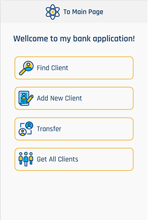
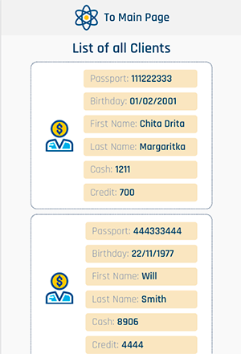
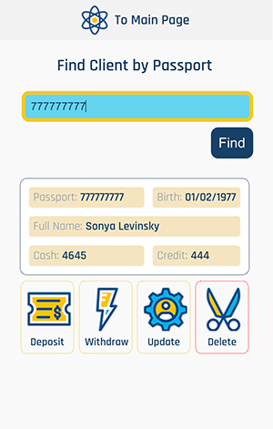

# Fullstack Bank Api

_It is week-end project of my bootcamp course, CRUD Fullstack application with a nice interface and responsive design for mobile devices as well._
_<a href="https://calm-dawn-90545.herokuapp.com" target="_blank">To Live Demo</a>_

<table >
  <tr>
    <td style='border: none' width="32%" style={border: none}></td>
    <td width="33%" style='border: none'></td>
    <td width="32%" style='border: none'></td>
  </tr>
  
</table>

### Used by:

<li>HTML
<li>CSS
<li>Javascript
<li>React
<li>NodeJs
<li>MongoDb

### Implemented functions:

<li>Get all clients, return list with infinite scroll
<li>Create new client
<li>Get particular client
<li>Update particular client
<li>Delete particular client
<li>Withdrow and deposit to/from client's account
<li>Transfer money from one account to another
